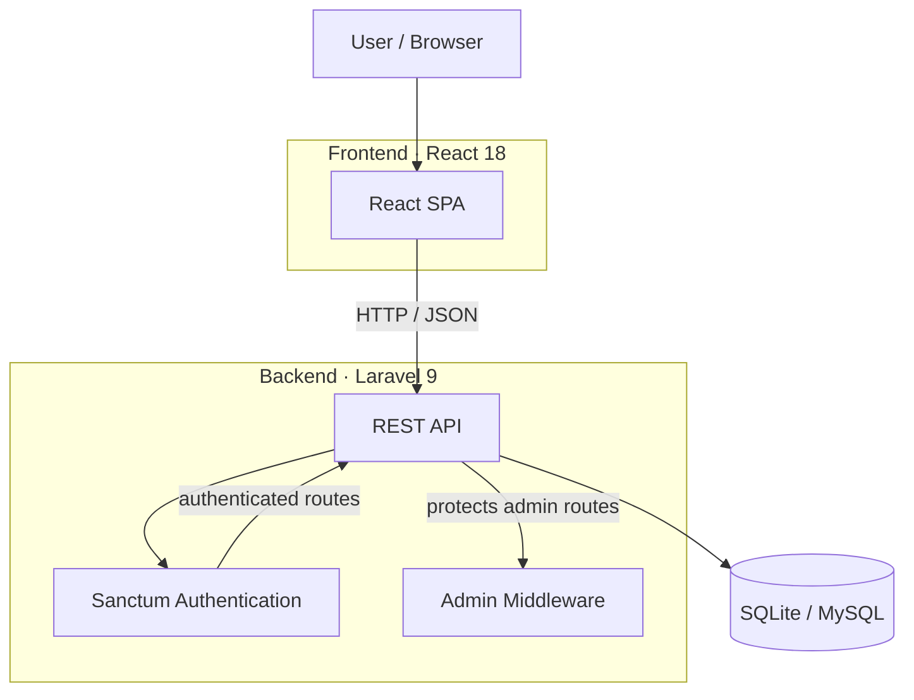
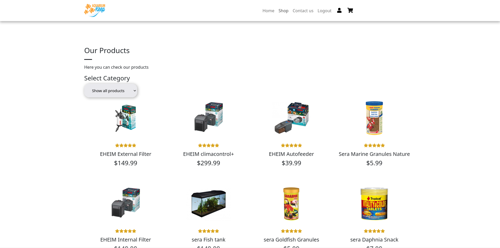
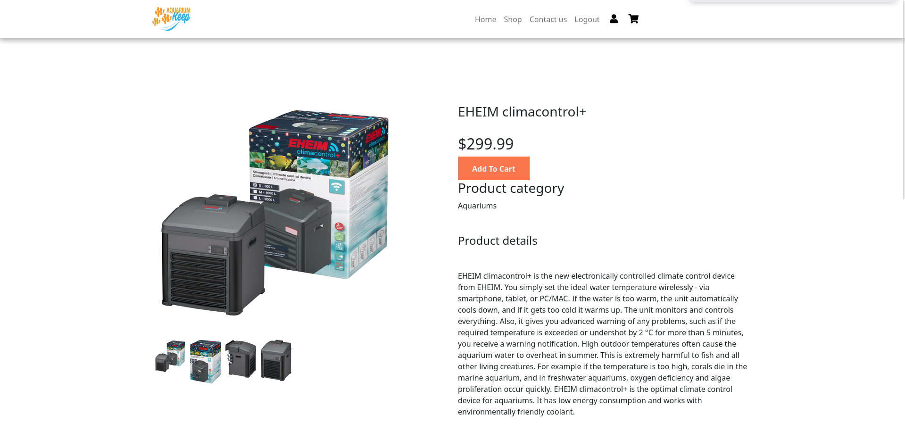
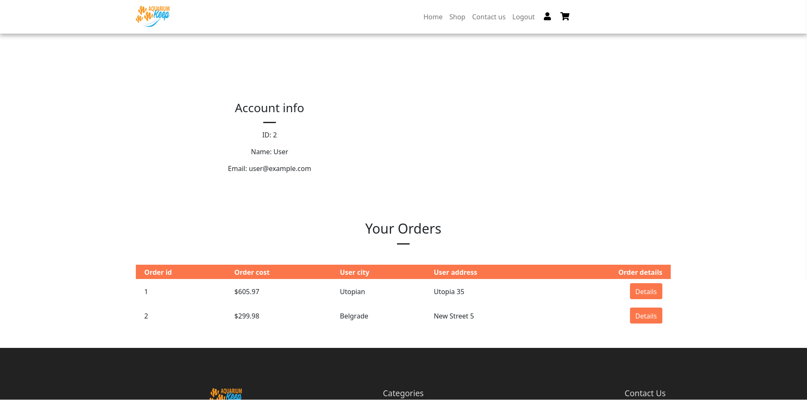
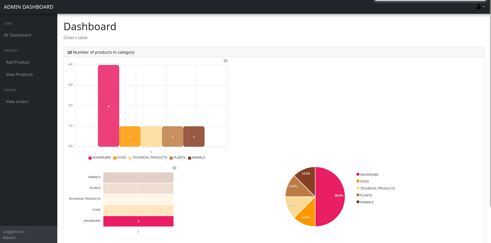

# Aquarium Keep
Full-stack e-commerce application for aquarium and fishkeeping products, built with **React** and **Laravel**.

The application provides a customer storefront, authentication, shopping cart and checkout, order history and a role-protected administration area for product and order management.

## Architecture


The project can be run locally using Docker Compose, which starts both the Laravel backend and React frontend. The backend exposes a REST API consumed by the React application. Authentication uses Laravel Sanctum bearer tokens, while administrative endpoints are protected by an additional `admin` middleware.

## Features

### Storefront
* Product catalog with category filtering and server-side pagination
* Product detail pages with multiple images
* Shopping cart
* Checkout with shipping information
* Responsive React UI
* Contact page with Google Maps integration

### Authentication and orders
* User registration and login
* Token-based authentication with Laravel Sanctum
* User account and order history
* Order item details
* Browser-based printable order invoices

### Administration
* Role-protected admin area
* Product CRUD
* Product image management
* Order listing
* Searchable, sortable and printable order table
* Dashboard charts for product/category statistics

### API and authorization
* RESTful Laravel API
* Request validation
* Eloquent relationships
* API Resources
* Role-based authorization
* SQLite and MySQL support
* Database migrations and seeders

## Tech stack
| Layer              | Technology                                 |
| ------------------ | ------------------------------------------ |
| Frontend           | React 18, React Router 6, Axios, Bootstrap |
| Frontend libraries | ApexCharts, DataTables, React Helmet       |
| Backend            | Laravel 9, PHP 8.2                         |
| Authentication     | Laravel Sanctum                            |
| Database           | SQLite / MySQL                             |
| Containerization   | Docker, Docker Compose                     |

## Project structure
```text
.
├── compose.yaml
├── backend/
│   ├── app/
│   │   ├── Http/
│   │   │   ├── Controllers/
│   │   │   └── Middleware/
│   │   └── Models/
│   ├── database/
│   │   ├── migrations/
│   │   ├── factories/
│   │   └── seeders/
│   ├── routes/
│   │   └── api.php
│   └── Dockerfile
└── frontend/
    ├── public/
    └── src/
        ├── components/
        ├── hooks/
        └── App.js
```

## Getting started

### Prerequisites
* Git
* Docker
* Docker Compose

### Run with Docker
Clone the repository and start the application:
```sh
git clone https://github.com/aleksa-radojicic/iteh_project.git
cd iteh_project
docker compose up --build
```

The Docker Compose setup installs dependencies, initializes the Laravel environment, creates and seeds the SQLite database, and starts the Laravel and React development servers.

Open:
| Component   | URL                   |
| ----------- | --------------------- |
| Frontend    | http://localhost:3000 |
| Backend API | http://localhost:8000 |

### Demo accounts
The database seeders creates one administrator and one regular user account.

| Role  | Email               | Password |
| ----- | ------------------- | -------- |
| Admin | `admin@example.com` | `admin`  |
| User  | `user@example.com`  | `user`   |

These credentials are intended only for the local demo environment.

After logging in as an administrator, open `http://localhost:3000/admin`.

### Database behavior
The current Docker configuration runs `php artisan migrate:fresh --seed --force` when the backend container starts. This means the database is recreated and reseeded on each `docker compose up`, so changes made through the application are not persistent across container restarts.

The default seed process creates the predefined users and 1000 generated products.

## Development
See the component-specific documentation:
- [Backend](backend/README.md)
- [Frontend](frontend/README.md)

## Screenshots

| All Products | Single Product |
|:---:|:---:|
|  |  |

| User Orders | Admin |
|:---:|:---:|
|  |  |